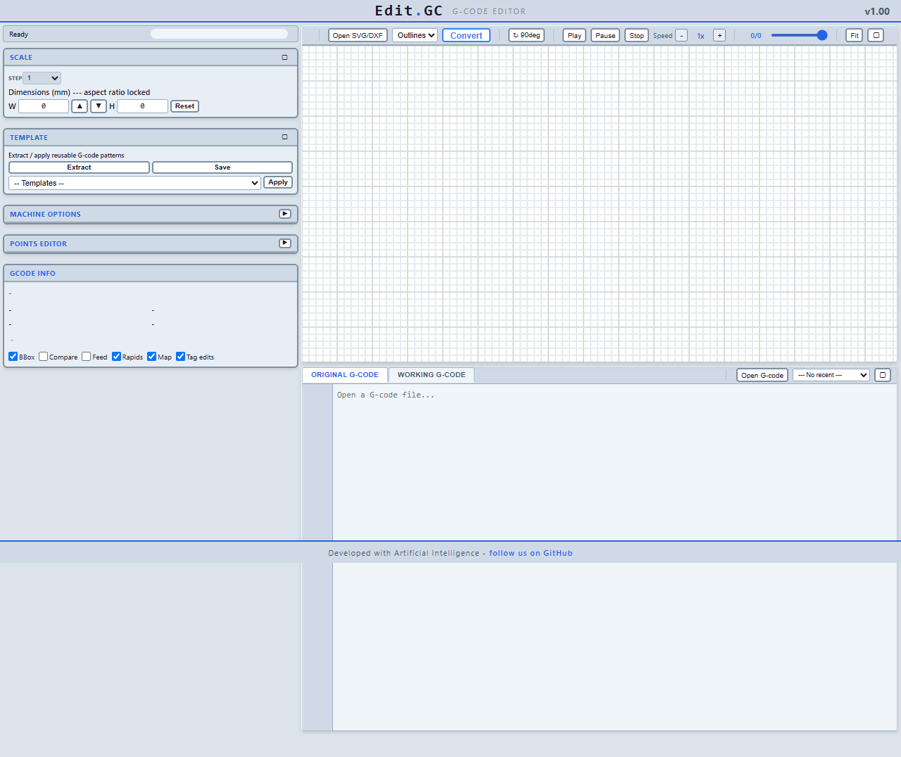

# Edit.GC

Browser-based G-code editor for laser/CNC. Edit paths, convert SVG/DXF to G-code, preview toolpaths — no install needed.

## Quick start

Open `app/index.html` in any browser.
Drag & drop `.gcode`, `.svg`, or `.dxf` files, or use the **Open** buttons.
Select a **Template**, adjust options, click **Convert**.

## Features

### G-code Editor
- Original + Working editors side by side, syntax highlighted
- Find & Replace (regex, case toggle), Undo/Redo (50 levels)
- Virtual editor for files >15k lines
- `;edit.gc` tags on modified lines

### Points Editor (6 widgets)
- **Set Start Coordinates** — moves first cut point to entered X/Y/Z, shifts rest by delta
- **Add Points** — duplicate selected points with offset (Continuous or Start/Stop with laser on/off)
- **Add Point at Minimum Distance** — subdivide cut segments at fixed interval (skips rapids)
- **Shift Points** — batch X/Y/Z shift (all, selected, or range)
- **Full Path Variation** — inside/outside offset copies of entire path with laser-off/travel/laser-on
- **Full Turn Path Variation** — alternating ±offset perpendicular to each segment
- Mark Start / Set Side — reorder path, reverse direction

### SVG/DXF → G-code
- Drag & drop, preview as outlines/points
- Scale (aspect locked), Rotate 90°, Multi-pass with Z Step
- **Interior-first cutting** — nested shapes cut inside→outside with laser-off/travel/laser-on between shapes
- **Multi-pass bidirectional** — open paths alternate forward/reverse, closed paths same direction (no laser-off between passes)

### Templates
- **Grbl**, **Smoothieware**, **Marlin (Laser)**, **SM300**
- Per-template options: passes, feed rates, laser mode (M3/M4), gas, Z step, focus Z
- Settings saved to localStorage

### SM300 Support
- Implicit motion (no G0/G1), laser programs, gas, safety
- Z in every move (focusZ + pass × zStep)

### Preview
- 2D toolpath with pan/zoom/fit, playback, minimap
- Compare mode (original as dashed line)
- M3/M4 both recognised as tool-on (purple), tool-off (red)

## License

MIT
