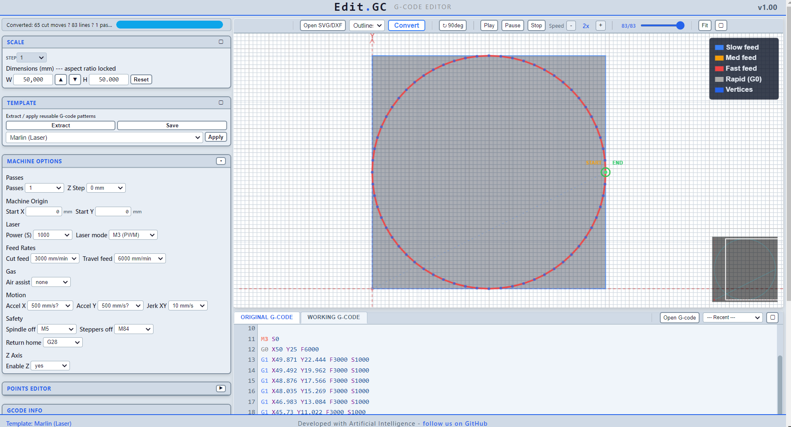

# Edit.GC

Browser-based G-code editor for laser/CNC.

## Quick start

Open `app/index.html` in any browser. Drag & drop `.gcode`, `.svg`, `.dxf` or use **Open** buttons. Select a **Template**, adjust options, click **Convert**.

## Features

- Dual G-code editors, Find & Replace, Undo/Redo (50 levels), virtual editor for large files
- Points Editor (6 widgets): Set Start, Add Points, Min Distance, Shift, Full Path Variation, Full Turn Path Variation, Mark Start / Set Side
- SVG/DXF to G-code with Scale, Rotate, Multi-pass Z Step, interior-first cutting, bidirectional passes
- Templates: Grbl, Smoothieware, Marlin, SM300 — per-template options saved to localStorage
- SM300: implicit motion, laser programs, gas, Z in every move
- Preview: 2D toolpath, pan/zoom, playback, minimap, compare mode (original as dashed)

## License

MIT — free to share and modify
