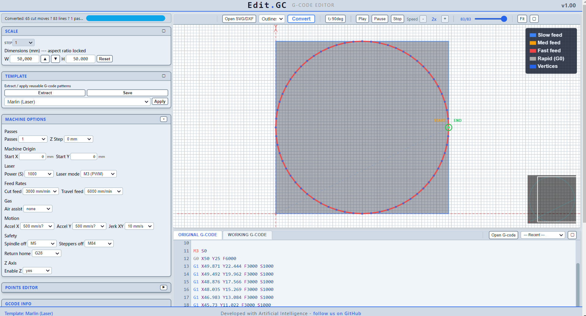

# Edit.GC

Browser-based G-code editor **focused on editing individual G-code lines**. Select, reorder, delete, offset, and generate path variations — all from the visual toolpath preview.

## Quick start

Open `app/index.html` in any browser. Drag & drop `.gcode`, `.svg`, `.dxf` or use **Open** buttons. Select a **Template**, adjust options, click **Convert**. Open the **Points Editor** for full path editing power.

## Points Editor

Select points on the preview (click or right-click context menu) and apply:

- **Mark Start / Set Side** — reorder path from any point, reverse direction
- **Add Points** — along path or start/stop with travel + tool on/off
- **Delete Points** — remove selected points
- **Add Point at Minimum Distance** — subdivide segments into fixed steps
- **Shift Points** — batch offset X/Y/Z by line range
- **Full Path Variation** — inside/outside offset passes
- **Full Turn Path Variation** — alternating perpendicular offset
- **Speed & Power** — 3 color presets assign per-point feed/power via click or context menu
- **Multi-select** — Tab/Space to toggle, then apply any operation

Undo history (50 levels), modified lines tagged `;edit.gc`.

## Features

- Dual editors, Find & Replace, Undo/Redo, virtual editor for large files
- SVG/DXF to G-code with Scale, Rotate, Multi-pass Z, interior-first, bidirectional
- Templates: Grbl, FluidNC, Smoothieware, Marlin, SM300, KUKA (experimental) with per-template machine options
- SM300: implicit motion, laser programs, gas, Z moves, RA/RLAD commands
- KUKA Robot (KRL): experimental — 6-axis robot G-code with .src/.dat export, ISO/3D preview
- Preview: 2D toolpath, pan/zoom, playback, minimap, color by feed, vertex dots
- Rotate 90° preserving machine origin
- G0-G3 arcs, G91 relative, M3/M4/M5 laser, SM300 custom commands

## License

MIT
